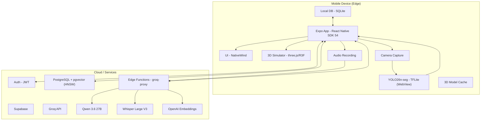
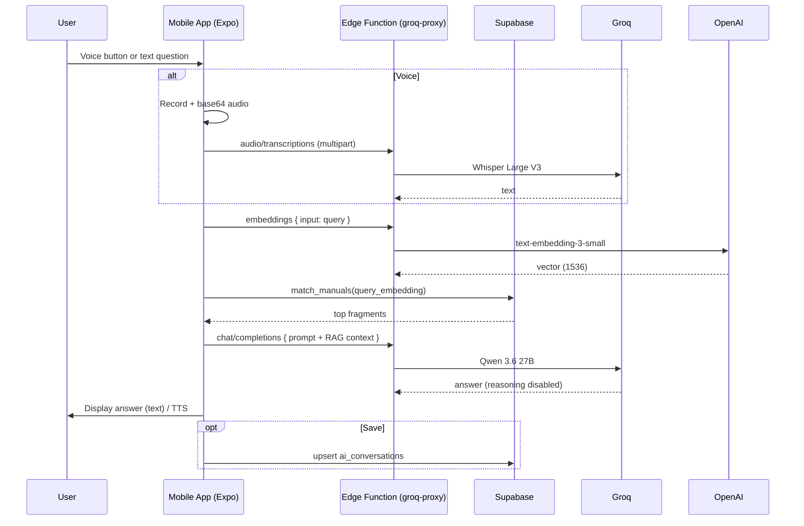
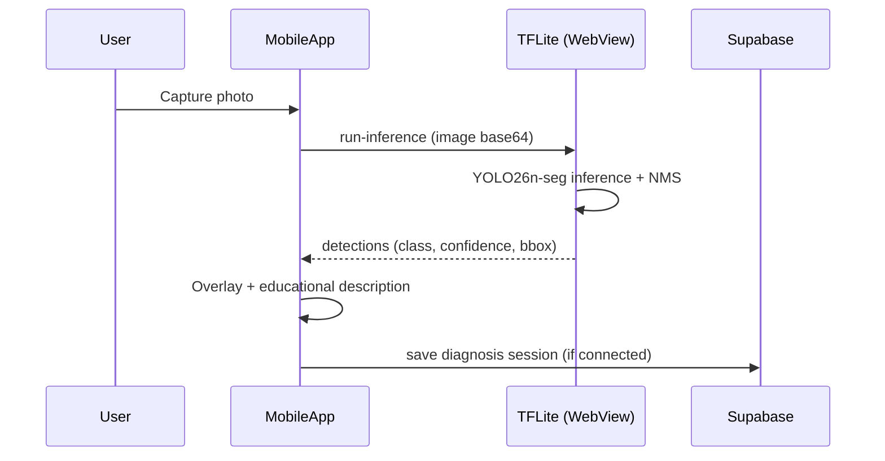

# Product Requirements Document (PRD)

**Project: Dentify**
**Version:** 3.0
**Date:** August 2026
**Context:** Master's Degree in Software Development – UPT Aragua, Venezuela
**Case Study:** Faculty of Dentistry – Universidad Nacional Experimental de los Llanos Centrales Rómulo Gallegos (UNERG)
**Research Line:** Artificial Intelligence and Machine Learning
**Standard:** IEEE 830-1998

---

## Table of Contents

1. [Introduction](#1-introduction)
2. [General Product Description](#2-general-product-description)
3. [Functional Requirements](#3-functional-requirements)
4. [Non-Functional Requirements](#4-non-functional-requirements)
5. [External Interfaces](#5-external-interfaces)
6. [Logical Architecture](#6-logical-architecture)
7. [Database Schema](#7-database-schema)
8. [Intelligent Agent Flow](#8-intelligent-agent-flow)
9. [Requirements Traceability Matrix](#9-requirements-traceability-matrix)
10. [Appendices](#10-appendices)

---

## 1. Introduction

### 1.1 Purpose

This Product Requirements Document (PRD) defines the requirements for **Dentify**, an educational mobile application developed as part of the Master's Degree in Software Development at the Universidad Politécnica Territorial del Estado Aragua Federico Brito Figueroa (UPT Aragua). The case study is the Faculty of Dentistry at the Universidad Nacional Experimental de los Llanos Centrales Rómulo Gallegos (UNERG).

Dentify provides dental students with an interactive, AI-powered tool to practice clinical diagnosis, study dental anatomy, and receive personalized tutoring through four integrated modules: a multimodal conversational assistant (Denty-AI), an interactive 3D simulator of dental anatomy, a computer-vision diagnosis module, and a gamified pedagogical pathway.

### 1.2 Scope

Dentify is a mobile application built with **Expo SDK 54 (React Native)** for iOS and Android, running on the **Expo Go** client during development and evaluation. It includes:

- **Denty-AI**: a multimodal conversational assistant (text/voice) that answers clinical questions grounded in Venezuelan dental manuals via Retrieval-Augmented Generation (RAG).
- **3D Simulator**: interactive visualization of dental pieces with rotation, zoom, and anatomical structure selection.
- **Vision Diagnosis**: real-time identification of dental conditions in photographs using a locally run YOLO segmentation model.
- **Pedagogical Path**: a gamified progression through dental specialties (Operative Dentistry, Endodontics, Periodontics, etc.) with quizzes and diagnosis challenges.

The system follows an **Edge-First** architecture: vision and 3D processing run entirely on the device, while cloud services handle language inference, semantic embeddings, and persistence.

### 1.3 Definitions, Acronyms, and Abbreviations

| Term | Definition |
| --- | --- |
| **PRD** | Product Requirements Document |
| **UNERG** | Universidad Nacional Experimental de los Llanos Centrales Rómulo Gallegos |
| **RAG** | Retrieval-Augmented Generation |
| **YOLO26n-seg** | Nano segmentation variant of the YOLO architecture (Ultralytics YOLO v8.4+) used for object segmentation on mobile |
| **TFLite** | TensorFlow Lite — framework for running ML models on mobile devices |
| **pgvector** | PostgreSQL extension for vector similarity search (HNSW index) |
| **GLB / KHR_mesh_quantization** | 3D file format and quantization extension used to compress polygonal meshes (supported natively by three.js, no runtime decoder) |
| **Expo** | Development framework for React Native |
| **NativeWind** | Tailwind CSS-based styling library for React Native |
| **Groq** | Cloud inference provider serving the chat (Qwen 3.6 27B) and Whisper (STT) models |
| **STT / TTS** | Speech-to-Text / Text-to-Speech |

### 1.4 References

- IEEE Std 830-1998 — *Recommended Practice for Software Requirements Specifications*.
- ISO/IEC 25010:2023 — *Systems and software Quality Requirements and Evaluation (SQuaRE)*.
- UNERG Clinical Dental Procedures Manual (2024 edition) and selected clinical textbooks.
- Official documentation for Supabase, Expo SDK 54, TensorFlow Lite, Groq API, OpenAI Embeddings API.

### 1.5 Document Overview

Section 2 gives a high-level product description. Section 3 details the functional requirements by module. Section 4 covers non-functional requirements aligned with ISO/IEC 25010. Sections 5–8 contain the technical artifacts (external interfaces, logical architecture, database schema, and agent flow). Section 9 is the requirements traceability matrix, and Section 10 the appendices.

---

## 2. General Product Description

### 2.1 Product Perspective

Dentify is a standalone system that runs on students' mobile devices. It integrates with the following external services:

- **Supabase**: authentication, relational database (PostgreSQL), vector storage (pgvector) for RAG, and Edge Functions.
- **Groq API**: inference for the chat model (**Qwen 3.6 27B**, multimodal) and **Whisper Large V3** (speech-to-text).
- **OpenAI Embeddings API**: `text-embedding-3-small` (1536 dimensions) to embed RAG queries and manual fragments.
- **3D Model CDN**: distribution of `.glb` models optimized with `KHR_mesh_quantization` and JPEG textures (bundled assets, no runtime decoder).

Vision processing (YOLO26n-seg) runs **locally** via TensorFlow Lite inside a WebView. Voice is recorded on the device, transcribed by Whisper through a Supabase Edge Function, and text is sent to the chat model.

### 2.2 Product Functions

| Module | Key Functions |
| --- | --- |
| **Denty-AI** | Multimodal conversational assistant (text/voice). Answers based on clinical manuals via RAG (vector search over pgvector). Voice navigation commands. Persisted conversation history. |
| **3D Simulator** | Interactive visualization of dental models (incisor, canine, premolar, molar, both arches) with rotation, zoom, and structure selection. |
| **Vision Diagnosis** | Segmentation of dental conditions in captured photos (Abrasion, Filling, Crown, Caries classes). Educational description of the detected condition. Radiograph (X-ray) detection in development. |
| **Pedagogical Path** | Progression through dental specialties. Gamified assessments (quizzes, diagnosis challenges). Badges and XP tracking. Teacher progress view. |

### 2.3 User Characteristics

| Role | Description | Technical Level |
| --- | --- | --- |
| **Student** | Undergraduate/graduate dental student at UNERG. Uses the app for study and practice. | Basic smartphone user. |
| **Teacher** | Professor who monitors student progress and views usage statistics. | Intermediate digital competence. |
| **Admin** | Technical staff who manage content (manuals, 3D models) and infrastructure. | Advanced. |

### 2.4 Constraints

- **Platform**: iOS ≥ 15 and Android ≥ 11, targeting the **Expo Go** client (SDK 54) for evaluation.
- **Connectivity**: Internet is required for authentication, AI inference, and Supabase sync. Vision and 3D simulation work offline once resources are downloaded.
- **Language**: All content is in **Spanish**, including the interface and indexed clinical manuals.
- **Regulatory Compliance**: Educational content aligns with UNERG's official curricula.

### 2.5 Assumptions and Dependencies

- The student has a smartphone with a camera and at least 4 GB of RAM.
- RAG quality depends on the completeness of the indexed clinical manuals (two manuals currently).
- AI availability depends on Groq/OpenAI cloud services.
- 3D models are provided by the content team under an appropriate license.

---

## 3. Functional Requirements

### 3.1 Denty-AI Module

| ID | Description | Priority |
| --- | --- | --- |
| **FR-01** | The system shall allow the user to ask clinical questions via text input. | High |
| **FR-02** | The system shall allow the user to ask questions via voice, transcribing audio with Whisper Large V3. | High |
| **FR-03** | Responses shall be generated using RAG: the query is embedded with `text-embedding-3-small`, the most relevant manual fragments are retrieved from `clinical_manuals` via pgvector cosine similarity, and the fragments are passed as context to the chat model (**Qwen 3.6 27B**). | High |
| **FR-04** | The assistant shall recognize voice navigation commands (e.g., "abrir simulador", "mostrar escáner") and navigate accordingly. | Medium |
| **FR-05** | Conversation history shall persist locally (SQLite) and sync with Supabase when connectivity is available. | Medium |

### 3.2 3D Simulator Module

| ID | Description | Priority |
| --- | --- | --- |
| **FR-06** | The system shall load and render optimized 3D models of dental pieces (`.glb` with `KHR_mesh_quantization` and JPEG textures). | High |
| **FR-07** | The user shall be able to rotate, zoom, and pan the model using touch gestures. | High |
| **FR-08** | The system shall display labels with anatomical structure names when a structure is selected. | Medium |

### 3.3 Vision Diagnosis Module

| ID | Description | Priority |
| --- | --- | --- |
| **FR-09** | The application shall run the YOLO26n-seg model locally via TensorFlow Lite and process captured photographs. | High |
| **FR-10** | It shall segment and report the following conditions: Abrasion, Filling, Crown, Caries classes 1–6. | High |
| **FR-11** | It shall provide a brief educational description of the detected condition (retrieved from the RAG corpus). | Medium |
| **FR-12** | It shall persist diagnosis sessions (image, detections, notes) in Supabase when connected. | Medium |
| **FR-13** | (Planned) It shall detect dental anomalies in **radiographs (X-ray)**: periapical lesions, restorations, and retained roots. | Low |

> Note: earlier versions of this PRD listed instrument detection (mirror, explorer, forceps). Instrument detection has been **removed from scope**; the trained model covers the oral conditions listed in FR-10.

### 3.4 Pedagogical Path Module

| ID | Description | Priority |
| --- | --- | --- |
| **FR-14** | The system shall present a progression of levels organized by dental specialty. | High |
| **FR-15** | Each level shall include theoretical content and/or an interactive quiz. | High |
| **FR-16** | Completing a level shall unlock the next one and award badges or experience points. | High |
| **FR-17** | Student progress shall be stored in Supabase and be visible to authorized teachers. | Medium |
| **FR-18** | The path shall offer personalized recommendations based on student performance. | Low |

---

## 4. Non-Functional Requirements

Aligned with **ISO/IEC 25010**.

| Category | ID | Description | Acceptance Criteria |
| --- | --- | --- | --- |
| **Performance** | NFR-01 | Denty-AI response time (from end of question to start of response) shall not exceed 3 s under 4G conditions. | Load tests against the deployed Edge Function. |
|  | NFR-02 | 3D models shall load in under 2 s after the initial download. | Asset caching measurement. |
| **Maintainability** | NFR-03 | Source code shall be written in TypeScript with strict typing. | `tsc --noEmit` passes; ESLint clean. |
|  | NFR-04 | AI models and RAG manuals shall be updatable without app recompilation. | Manuals re-ingested via the ingestion script; model swapped as an asset. |
| **Reliability** | NFR-05 | The application shall degrade gracefully when the backend is unavailable: chat returns an explanatory message and RAG falls back to lexical search. | Airplane-mode tests. |
| **Security** | NFR-06 | All communication with Supabase/Groq/OpenAI shall use HTTPS; API keys stay server-side (Supabase Secrets + Edge Function). | Network traffic inspection; no key in the client bundle. |
|  | NFR-07 | Student personal data shall be protected by Supabase Auth and Row Level Security. | RLS policy review. |
| **Usability** | NFR-08 | The interface shall follow the Clinical Clarity design system (DESIGN.md) and be responsive. | Design review with representative users. |
| **Portability** | NFR-09 | The application shall behave identically on iOS and Android, except for platform restrictions. | Testing on iPhone 14 and Pixel 7 (Expo Go). |

---

## 5. External Interfaces

### 5.1 User Interfaces

- Native mobile application with Expo SDK 54 / React Native.
- Styling via **NativeWind** (Tailwind CSS).
- Light/dark mode based on system preference.

### 5.2 Hardware Interfaces

- Device rear camera (diagnosis module).
- Microphone (voice input).
- Accelerometer/Gyroscope (optional, 3D interaction).

### 5.3 Software Interfaces

| External Component | Protocol / Format | Purpose |
| --- | --- | --- |
| **Supabase** | REST / PostgreSQL | Auth, relational + vector storage, Edge Functions. |
| **Groq API** | HTTPS / JSON | Chat (Qwen 3.6 27B) and Whisper (STT) inference. |
| **OpenAI Embeddings API** | HTTPS / JSON | `text-embedding-3-small` for RAG. |
| **3D Model CDN** | HTTPS / GLB (optimized) | Download of anatomical models. |

### 5.4 Communication Interfaces

- WiFi / mobile data (4G/5G).
- Background synchronization with Supabase for progress and conversations.

---

## 6. Logical Architecture



**Edge-First Description:**

- Vision (YOLO26n-seg) and 3D rendering run **on device** (offline-capable).
- The chat assistant routes through the `groq-proxy` Edge Function: the client sends the query, the function retrieves the semantic embedding (OpenAI), the client queries `match_manuals` (pgvector), and the function completes the answer with Qwen 3.6 27B. API keys live only in Supabase Secrets.
- Supabase acts as the unified backend: auth, relational + vector storage, and Edge Functions.

---

## 7. Database Schema

Tables: `profiles`, `clinical_manuals`, `pedagogical_progress`, `diagnosis_sessions`, `ai_conversations`, `badges`, `user_badges`. Implemented in `supabase/migrations/`.

**RAG core (pgvector):**

```sql
CREATE TABLE public.clinical_manuals (
    id UUID PRIMARY KEY DEFAULT gen_random_uuid(),
    title TEXT NOT NULL,
    content TEXT NOT NULL,
    source_document TEXT,
    page_number INTEGER,
    embedding VECTOR(1536)
);
CREATE INDEX ON public.clinical_manuals USING hnsw (embedding vector_cosine_ops);
```

**Search functions:**
- `match_manuals(query_embedding text, match_count int)` — cosine similarity search (HNSW) over embeddings.
- `match_manuals_by_text(search_query text, match_count int)` — trigram (`pg_trgm`) lexical fallback.

Full schema is in `supabase/migrations/`; the RAG corpus is loaded by `scripts/ingest-rag.mjs` (parses the PDFs in `docs/`, chunks at 500 words with 50 overlap, embeds with `text-embedding-3-small`, and upserts).

---

## 8. Intelligent Agent Flow

**Denty-AI query (RAG):**



**Vision diagnosis (local agent):**



---

## 9. Requirements Traceability Matrix

| Requirement | Description | Module | Technical Component | Verification |
| --- | --- | --- | --- | --- |
| FR-01 | Text questions | Denty-AI | `ChatInput`, `chatWithContext`, Groq (Qwen) | Manual + unit test |
| FR-02 | Voice questions | Denty-AI | `expo-audio` recording, `transcribeAudio`, Whisper | Audio integration test |
| FR-03 | RAG over manuals | Denty-AI | `match_manuals` (pgvector), `embeddings.ts`, OpenAI | Vector retrieval test + live query |
| FR-04 | Voice navigation | Denty-AI | `voiceCommands.ts` | Unit test |
| FR-05 | Persistent history | Denty-AI | SQLite + `ai_conversations` | Offline/online sync test |
| FR-06 | Compressed GLB loading | 3D Simulator | three.js, `modelCache`, Expo GL | Load-time measurement |
| FR-07 | Touch manipulation | 3D Simulator | R3F gestures | Device test |
| FR-08 | Anatomical labels | 3D Simulator | Raycaster + overlays | Device test |
| FR-09 | Local YOLO segmentation | Vision | `yolo.ts`, TFLite WebView | FPS / shape test |
| FR-10 | Condition classes | Vision | YOLO26n-seg (9 classes) | Validation on dataset |
| FR-11 | Educational description | Vision | RAG cache query | Manual-match test |
| FR-12 | Diagnosis persistence | Vision | `diagnosis_sessions` | Storage test |
| FR-13 | Radiograph detection (planned) | Vision | Future model | Not yet implemented |
| FR-14 | Specialty progression | Path | Level UI + `pedagogical_progress` | Navigation test |
| FR-15 | Quizzes / challenges | Path | `quizData.ts`, quiz screen | Automatic scoring |
| FR-16 | Badges and XP | Path | `badges`, `user_badges`, `useBadges` | Profile display |
| FR-17 | Teacher progress view | Path | Teacher screen | Role-based access |
| FR-18 | Personalized recommendations | Path | Score-based algorithm | Review |

---

## 10. Appendices

### Appendix A – RAG Embedding Model

- Model: `text-embedding-3-small` — **1536 dimensions**.
- Chunking: 500-token fragments with 50-token overlap.
- Indexing: HNSW (pgvector, cosine).
- Offline fallback: deterministic 1536-dim bag-of-words vectorizer (`src/services/embeddings.ts`) used when the backend is unreachable.

### Appendix B – Vision Model Specification

- Architecture: YOLO26n-seg (Ultralytics), INT8 quantized, **segmentation** task.
- Input: 640×640 RGB.
- Output classes (9): Abrasion, Filling, Crown, Caries classes 1–6.
- Inference: TensorFlow Lite via `@tensorflow/tfjs-tflite` in a WebView (Expo Go compatible).

### Appendix C – AI Models

| Use | Provider | Model |
| --- | --- | --- |
| Clinical chat | Groq | `qwen/qwen3.6-27b` (reasoning disabled) |
| Speech-to-text | Groq | `whisper-large-v3` |
| Embeddings | OpenAI | `text-embedding-3-small` (1536) |

### Appendix D – Test Plan (ISO/IEC 25010)

| Characteristic | Metric | Tool |
| --- | --- | --- |
| Efficiency | API response time | Supabase Logs, Perf Monitor |
| Maintainability | Coverage, cyclomatic complexity | Jest, ESLint, `tsc` |
| Usability | Task success rate (SUS) | Tests with UNERG students |
| Reliability | Offline error rate | Network stress tests |

---

**End of Document**
*Prepared for the Master's Degree in Software Development – UPT Aragua, 2026.*
*Case Study: Faculty of Dentistry – UNERG.*
